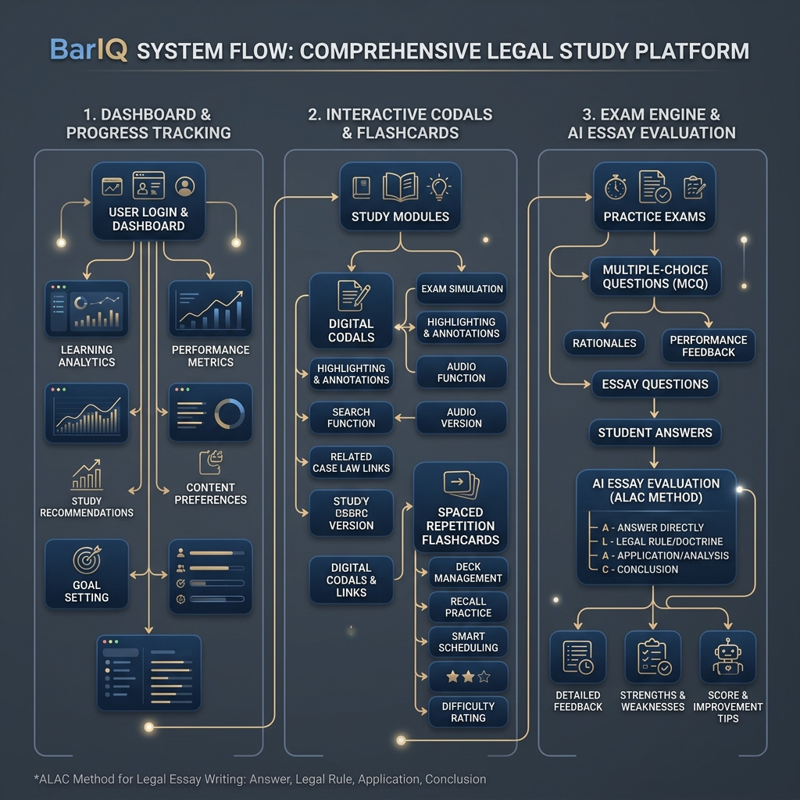

# BarIQ System Architecture & Developer Documentation

Welcome to the **BarIQ** developer documentation. This document is written to help new and existing software engineers quickly understand the code structure, database models, system flows, and technical stack of the BarIQ Philippine Law Review Application.

---

## 🏛️ System Overview & Design Aesthetics
BarIQ is a premium, specialized learning management system designed for Philippine law students (Juris Doctor) and Bar Examination reviewees. 

To evoke the prestige and focus required for legal study, the application utilizes a curated visual design language:
*   **Theme:** Deep slate background (`#0f172a`), royal navy navigation elements, and gold/brass borders and icons representing traditional legal aesthetics in a clean, modern form.
*   **Syllabus Focus:** All materials are categorized based on the **6 Core Subjects** of the modern Philippine Bar Examination (Civil Law, Criminal Law, Political and International Law, Commercial and Taxation Laws, Labor Law and Social Legislation, Remedial Law & Legal Ethics).

---

## 🔄 System Flows
The following flow diagram shows the logical links between the frontend layouts, client API wrappers, Mongoose schemas, and background services:



### Logical Sub-Systems:
1.  **The Codal Reader:** Loads articles from the `Codals` collection. Highlights can be dynamically saved as custom cards directly into the `Flashcards` collection.
2.  **Spaced Repetition System (SRS):** Decks retrieve flashcards for the active user where `nextReviewDate` <= `now`. Card reviews increment/decrement the card's `box` rating (Leitner 1 to 5), updating `nextReviewDate` based on spaced intervals.
3.  **Mock Exam Simulator:** Displays Multiple Choice and Essay problems. MCQ is graded instantly. Essay practice provides a draft area, prompting students to write structure following the **ALAC method** (Answer, Legal Basis, Application, Conclusion). Submission fires an evaluation request that logs outcomes in the `ExamResponse` collection.

---

## 🗄️ Database Schema & Data Models
BarIQ uses MongoDB as its primary store managed by **Mongoose**. There are five main models:

### 1. `User` (Managed in `models/User.ts`)
Tracks authentication credentials, user role (student, reviewee, admin), target exam year, and daily study targets.
*   *Key Fields:* `fullName`, `email`, `password` (hashed with bcrypt), `role`, `yearLevel`, `studyGoals`.

### 2. `Codal` (Managed in `models/Codal.ts`)
Stores the actual statutory text of Philippine codes.
*   *Key Fields:* `subject` (e.g., Civil Law), `book`, `title`, `articleNumber` (e.g., "1156"), `content`.

### 3. `Flashcard` (Managed in `models/Flashcard.ts`)
Tracks flashcards assigned to users.
*   *Key Fields:* `userId` (foreign key pointing to User), `subject`, `front`, `back`, `box` (Leitner box, 1-5), `nextReviewDate`.

### 4. `Question` (Managed in `models/Question.ts`)
Questions database for practice test materials.
*   *Key Fields:* `subject`, `topic`, `type` (MCQ or Essay), `scenario` (the problem statement), `options` (for MCQ), `correctExplanation`, `suggestedAnswer` (sample ALAC model answer for Essays).

### 5. `ExamResponse` (Managed in `models/ExamResponse.ts`)
Tracks student performance on exam sheets.
*   *Key Fields:* `userId`, `questionId` (points to Question), `type`, `userAnswer`, `isCorrect`, `score` (0-100), `aiFeedback` (rubric scoring report containing Legal Knowledge, Application, and Logic/Presentation scores).

---

## 📂 Project Structure
```bash
law-app/
├── app/
│   ├── api/
│   │   ├── auth/          # Authentication handlers
│   │   ├── codals/        # Codal lookup APIs
│   │   ├── flashcards/    # SRS fetch and update APIs
│   │   ├── questions/     # MCQ and Essay fetch APIs
│   │   ├── submit/        # Grading and submission routes
│   │   ├── analytics/     # Metric aggregation APIs
│   │   └── seed/          # Initial database population utility
│   ├── home/
│   │   ├── layout.tsx     # Sidebar shell for the review dashboard
│   │   ├── page.tsx       # Root entry redirecting to dashboard
│   │   ├── dashboard.tsx  # Core statistics, streaks, and progress cards
│   │   ├── codals/        # Screen for browsing Philippine Codals
│   │   ├── flashcards/    # Flashcard deck swipe UI
│   │   ├── practice/      # Practice modules hub (MCQ & Essay entries)
│   │   └── analytics/     # Performance mastery heatmaps
│   ├── layout.tsx         # Global fonts and stylesheet setup
│   └── page.tsx           # Entry login / signup tabs selector
├── components/
│   ├── auth/              # Authenticators (Sign In, Sign Up cards)
│   └── ui/                # Shared dashboard elements
├── lib/
│   ├── api.ts             # Axios service wrappers for client requests
│   └── mongodb.ts         # Connection pool cache for Mongoose
├── models/                # Database model classes
└── public/                # Static assets (images, icons)
```

---

## 🚀 Setup & Seeding Database
To populate your local database with sample law review questions, codals, and flashcards:
1.  Verify that your `.env.local` contains a valid `MONGODB_URI` connection string.
2.  Run the Next.js development server:
    ```bash
    npm run dev
    ```
3.  Authenticate by registering an account.
4.  Navigate to `/api/seed` in your browser (or trigger a GET request). This endpoint will populate the database with:
    *   **Civil Code Codals** (Obligations & Contracts, Articles 1156–1162).
    *   **Bar Exam MCQ Questions** (Civil Law, Mercantile Law, Criminal Law).
    *   **Syllabus Flashcards** (e.g., definitions of Contracts, Elements of Felonies).
