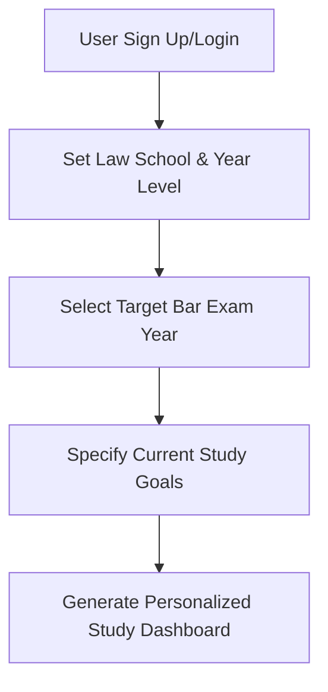
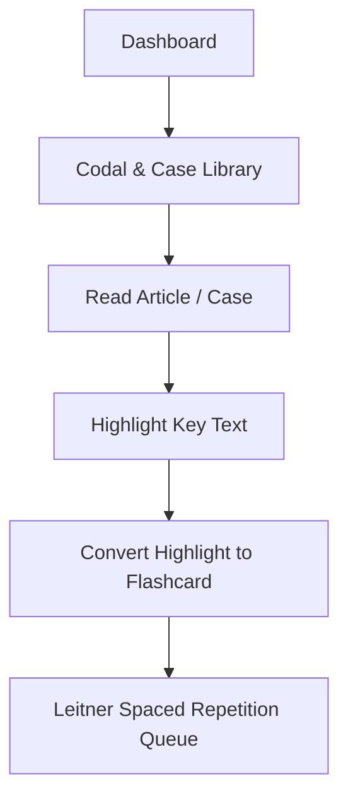
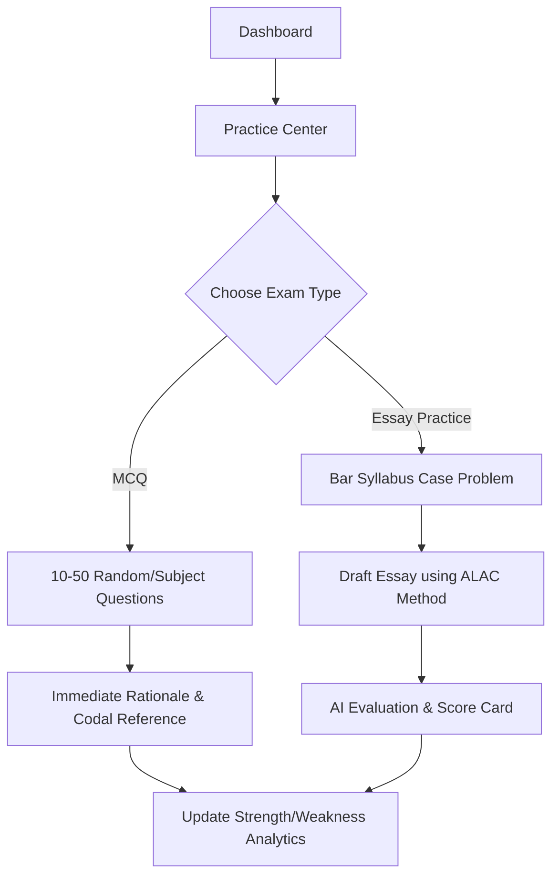

# BarIQ: Philippine Law Student & Bar Review Platform
## System Blueprint & Product Specification

BarIQ is a specialized, premium web application designed for Philippine law students (Juris Doctor program) and Bar Reviewees. It integrates interactive reading (Codals and Case Law), spaced repetition learning (Flashcards), and exam simulation (MCQs and Mock Essay writing based on the ALAC method) into a single, high-performance dashboard.

---

## ⚖️ Philippine Bar Exam Context
The system is structured around the **six (6) core subjects** of the modern Philippine Bar Examinations (as structured under recent Supreme Court Bar bulletins):
1. **Political and International Law** (including Constitutional Law, Administrative Law, Public International Law)
2. **Commercial and Taxation Laws** (Corporation Law, Securities, Insurance, Banking, NIRC, Tariff)
3. **Civil Law** (Persons, Property, Succession, Obligations & Contracts, Sales, Torts)
4. **Labor Law and Social Legislation** (Labor Standards, Labor Relations, Social Security)
5. **Criminal Law** (Revised Penal Code, Special Penal Laws)
6. **Remedial Law, Legal Ethics, and Practical Exercises** (Rules of Civil/Criminal Procedure, Evidence, Rules on Electronic Evidence, Legal Ethics, Legal Forms)

---

## 🔄 Overall System Flows

Here is the high-level system flow diagram showing user interaction across the dashboard, codal library, flashcards, and the exam engine:


### 1. Onboarding & Study Personalization Flow

*   **Targeting:** Users identify as 1L/2L/3L/4L student or a full-time Bar Reviewee. This hides/shows relevant materials (e.g., specific subjects vs. full-scale bar reviews).
*   **Goal Tracking:** Establish daily study targets (e.g., "30 articles read, 20 flashcards reviewed, 5 MCQs answered").

### 2. Interactive Study & Active Recall Flow

*   **Double-Loop Learning:** Reading codals is passive. BarIQ prompts active recall by automatically generating or suggesting flashcards for highlighted text.

### 3. Practice & Mock Examination Flow

*   **The ALAC Method** (Answer, Legal Basis, Application, Conclusion) is the standard method for answering Philippine Bar essay questions. The essay exam simulator actively prompts students to frame their responses in this format.

---

## 🧩 Core Modules & Features

### 📦 Module A: Interactive Codal & Jurisprudence Library
A clean, distraction-free environment for reading codals and supreme court cases.
*   **Full Philippine Codal Database:** Searchable text of the Civil Code, Revised Penal Code, Rules of Court, Constitution, and major Special Penal/Commercial Laws.
*   **Jurisprudence Database (Landmark Decisions):** Key Supreme Court rulings tagged by subject matter, syllabus topic, and popular names (e.g., *Chi Ming Tsoi*, *Oposa v. Factoran*).
*   **Split-Screen Case Reader:** Read a codal article on the left side and read related landmark cases referencing that article on the right side.
*   **Interactive Tooltips:** Hovering over an article number in a case syllabus automatically pops up the full text of that article.

### 📦 Module B: Spaced Repetition System (SRS) Flashcards
A flashcard engine designed to drill memorization of codal articles, legal doctrines, and definitions.
*   **Pre-loaded Decks:** Standard decks covering major definitions (e.g., "What is a contract of adhesion?", "Requisites of self-defense").
*   **Spaced Repetition Algorithm (Leitner System):** Cards appear dynamically based on the student's rating of their memory strength.
*   **Custom Cards:** Students can select any text from a codal or case and save it as a front/back flashcard.

### 📦 Module C: Mock Exam Simulator (Examplify-Like Experience)
Prepares students for the actual digital Bar Examination interface.
*   **MCQ Mode:** Timed multiple-choice quizzes with rationales detailing *why* the other three options are incorrect under Philippine law.
*   **Essay Mode (ALAC Workspace):**
    *   Provides a case problem from past bar exams or custom bar-ops materials.
    *   Simulated exam text editor (disable copy/paste to mimic real bar environment).
    *   **ALAC Guiding Sidebar (Optional helper):** An outline assistant showing input boxes for (1) Direct Answer, (2) Legal Basis, (3) Application to Facts, (4) Final Conclusion.
*   **AI Bar Grader:** Integrated LLM that scores the essay based on Supreme Court grading guidelines:
    *   *Legal Knowledge (40%)* — Did they cite the correct law/jurisprudence?
    *   *Application (35%)* — Did they apply the facts to the legal elements correctly?
    *   *Logic & Presentation (25%)* — Coherence, grammar, ALAC formatting.

### 📦 Module D: Progress Tracker & Predictive Analytics
Provides diagnostic feedback to help students direct their study efforts.
*   **Bar Readiness Meter:** An overall score calculated from MCQ averages, flashcard completion, and mock essay scores.
*   **Subject Mastery Chart:** Heatmap of the 6 bar subjects showing sub-topic mastery (e.g., within Civil Law: "Strong in Torts (85%), Weak in Succession (42%)").
*   **Streak Tracker:** Encourages daily consistency with motivational widgets.

---

## 🗄️ Database Architecture (Mongoose Schemas)

Here is a recommended MongoDB schema design for implementing these features:

### 1. User Schema (`models/User.ts`)
Tracks authentication details, profile specs, and study targets.
```typescript
import mongoose, { Schema } from 'mongoose';

const UserSchema = new Schema({
  name: { type: String, required: true },
  email: { type: String, required: true, unique: true },
  password: { type: String, required: true },
  role: { type: String, enum: ['student', 'reviewee', 'admin'], default: 'student' },
  lawSchool: { type: String },
  yearLevel: { type: String, enum: ['1L', '2L', '3L', '4L', 'reviewee'] },
  targetBarYear: { type: Number },
  studyGoals: {
    dailyMcqTarget: { type: Number, default: 10 },
    dailyFlashcardTarget: { type: Number, default: 20 },
    dailyCodalReadTarget: { type: Number, default: 15 }, // articles
  },
  createdAt: { type: Date, default: Date.now }
});
```

### 2. Codal Schema (`models/Codal.ts`)
Stores codal articles with categorization.
```typescript
const CodalSchema = new Schema({
  subject: { type: String, required: true }, // e.g., "Civil Law"
  book: { type: String }, // e.g., "Book IV: Obligations and Contracts"
  title: { type: String }, // e.g., "Title I: Obligations"
  chapter: { type: String },
  articleNumber: { type: String, required: true }, // e.g., "1156"
  content: { type: String, required: true }, // e.g., "An obligation is a juridical necessity..."
  keywords: [{ type: String }],
  notes: { type: String }
});
```

### 3. Flashcard Schema (`models/Flashcard.ts`)
Manages spaced repetition review schedules.
```typescript
const FlashcardSchema = new Schema({
  userId: { type: Schema.Types.ObjectId, ref: 'User', required: true },
  subject: { type: String, required: true }, // e.g., "Criminal Law"
  front: { type: String, required: true }, // Question / Concept / Article No.
  back: { type: String, required: true }, // Answer / Full definition / Doctrines
  sourceArticle: { type: String }, // e.g., "Article 248, RPC"
  // Leitner SRS metrics
  box: { type: Number, default: 1 }, // Leitner boxes 1 to 5
  nextReviewDate: { type: Date, default: Date.now },
  createdAt: { type: Date, default: Date.now }
});
```

### 4. Mock Question Schema (`models/Question.ts`)
Stores MCQs and essay questions.
```typescript
const QuestionSchema = new Schema({
  subject: { type: String, required: true }, // e.g., "Remedial Law"
  topic: { type: String }, // e.g., "Jurisdiction", "Summary Procedure"
  type: { type: String, enum: ['MCQ', 'Essay'], required: true },
  scenario: { type: String, required: true }, // The legal problem/facts
  // For MCQs:
  options: [{
    text: { type: String },
    isCorrect: { type: Boolean }
  }],
  correctExplanation: { type: String }, // Rationale under PH law
  legalBasis: { type: String }, // e.g., "Rule 3, Section 1 of the Rules of Court"
  // For Essays:
  suggestedAnswer: { type: String } // Sample ALAC answer
});
```

### 5. Exam Response Schema (`models/ExamResponse.ts`)
Tracks student answers and evaluations.
```typescript
const ExamResponseSchema = new Schema({
  userId: { type: Schema.Types.ObjectId, ref: 'User', required: true },
  questionId: { type: Schema.Types.ObjectId, ref: 'Question', required: true },
  type: { type: String, enum: ['MCQ', 'Essay'], required: true },
  userAnswer: { type: String }, // text response or selected option text
  isCorrect: { type: Boolean }, // for MCQ
  score: { type: Number }, // for Essay (0-100)
  aiFeedback: {
    legalKnowledgeScore: { type: Number },
    applicationScore: { type: Number },
    logicPresentationScore: { type: Number },
    detailedCritique: { type: String },
    suggestedImprovements: { type: String }
  },
  timeSpentSeconds: { type: Number },
  createdAt: { type: Date, default: Date.now }
});
```

---

## 🎨 Premium User Interface Ideas (Next.js & Tailwind CSS)
To build a stunning, premium product, we will avoid generic colors and structures:
*   **The "Legal Gavel" Slate Theme:** Rich deep slate grays (`#0f172a`), royal navy accents (`#1e3a8a`), and warm brass/gold borders (`#d97706` / `#b45309`) reflecting traditional courtroom aesthetics with a ultra-modern clean finish.
*   **Interactive Codal Split-Pane:** A resizable sidebar on the reading page allowing students to search the Civil Code without leaving their active document or case summary.
*   **Clean Exam Interface (Zen Mode):** Minimalist layout hiding dashboard headers, keeping a countdown timer at the top, a rich-text text area, and progress dots representing exam status.
*   **Analytics Visualizations:** Interactive progress circles and canvas-based charts showing study activity calendars (similar to GitHub's contribution grid, but showing articles read and cards swiped).
